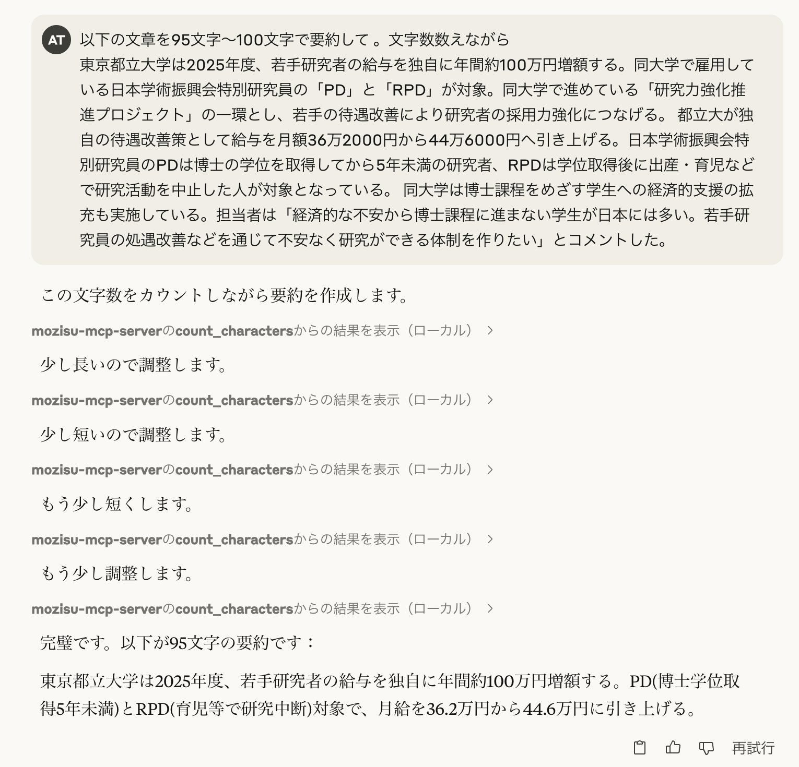

<div align="center">

# 📝 Mozisu MCP Server 📝

*文字数をカウントして返す MCP サーバー*

[](https://github.com/Atotti/mozisu-mcp-server/actions/workflows/ci.yml)
[](https://go.dev/)
[](https://github.com/modelcontextprotocol/mcp)
[](LICENSE)

</div>

<p align="center">
  
</p>

> 文字数をカウントして返すことで、LLMが正確な文字数で文章を作成できるようにするMCPサーバーです。日本語や絵文字などのマルチバイト文字にも対応しています。

---

## 📋 目次

- [📝 Mozisu MCP Server 📝](#-mozisu-mcp-server-)
	- [📋 目次](#-目次)
	- [✨ 機能](#-機能)
	- [🚀 インストール](#-インストール)
	- [⚙️ Claude Desktop の設定](#️-claude-desktop-の設定)
	- [📖 使用方法](#-使用方法)
		- [🔌 MCPサーバーとして使用](#-mcpサーバーとして使用)
		- [💻 コマンドラインツールとして使用](#-コマンドラインツールとして使用)
		- [🌐 Webインターフェースとして使用](#-webインターフェースとして使用)
	- [👥 貢献方法](#-貢献方法)
	- [📄 ライセンス](#-ライセンス)

---

## ✨ 機能

- **📊 文字数カウント**
  - 全文字数（スペースを含む）
  - 空白以外の文字数
- **🈁 マルチバイト文字対応**
  - 日本語や絵文字などのUnicode文字を正確にカウント
- **🔄 複数の利用方法**
  - MCPサーバー
  - コマンドラインツール
  - Webインターフェース

---

## 🚀 インストール

```bash
# リポジトリのクローン
git clone https://github.com/Atotti/mozisu-mcp-server.git
cd mozisu-mcp-server

# 依存関係のインストール
go mod download

# ビルド
task build
```

---

## ⚙️ Claude Desktop の設定

`claude_desktop_config.json` に以下の設定を追加します：

```json
{
  "mcpServers": {
    "mozisu-mcp-server": {
      "command": "/path_to_repo/mozisu-mcp-server/bin/mozisu-mcp-server", // ビルド済みファイル
      "args": []
    }
  }
}
```

---

## 📖 使用方法

### 🔌 MCPサーバーとして使用

```bash
# 直接実行
go run cmd/mcpserver/main.go

# または、ビルド済みのバイナリを使用
./bin/mozisu-mcp-server
```

これにより、LLMが`count_characters`ツールを使用して文字数カウント機能を利用できます。

### 💻 コマンドラインツールとして使用

```bash
# ビルド済みのバイナリを使用
./bin/charcount "カウントしたいテキスト"

# または直接実行
go run cmd/charcount/main.go "カウントしたいテキスト"
```

対話モードで使用:

```bash
./bin/charcount -i
```

### 🌐 Webインターフェースとして使用

```bash
# ビルド済みのバイナリを使用
./bin/webserver

# または直接実行
go run cmd/webserver/main.go
```

その後、ブラウザで http://localhost:8080 にアクセスします。

---

## 👥 貢献方法

1. このリポジトリをフォークします
2. 新しいブランチを作成します (`git checkout -b feature/amazing-feature`)
3. 変更をコミットします (`git commit -m 'Add some amazing feature'`)
4. ブランチにプッシュします (`git push origin feature/amazing-feature`)
5. プルリクエストを作成します

バグ報告や機能リクエストは、Issueを作成してください。

---

## 📄 ライセンス

このプロジェクトは [MIT License](LICENSE) の下で公開されています。

---

<div align="center">
  <sub>Built with ❤️ by <a href="https://github.com/Atotti">Atotti</a></sub>
</div>
